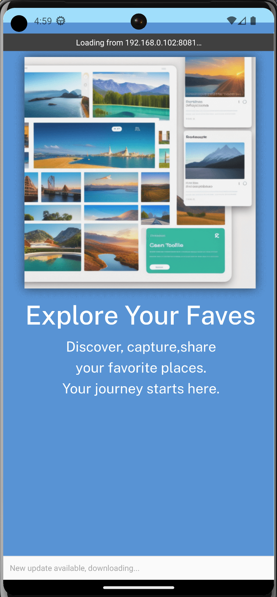
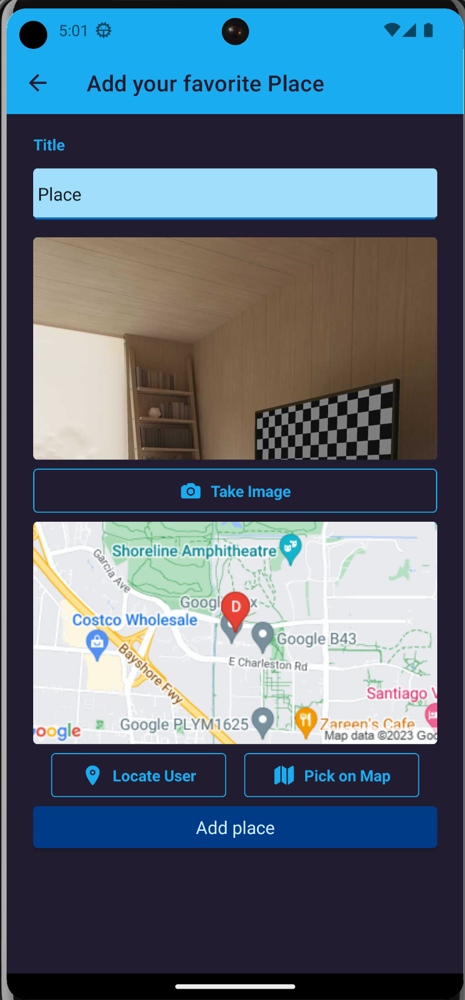

# FavePlaces 📍

FavePlaces is a React Native application developed using Expo and TypeScript, featuring a custom splash screen. It provides users with the ability to add their favorite places with ease and elegance.

  
  

## Features 🚀

* **Add Favorite Places:** Users can add their favorite locations by providing a title, taking a photo, and selecting a place on the map. They can also use the 'Locate User' button to automatically fetch their current location.
* **View Place Details:** Users can view the details of selected places, see the address in human-readable format, explore an enlarged photo, and check the location on the map.
* **Custom Splash Screen:** A beautiful, eye-catching splash screen for an engaging user experience.
* **Local Database Support:** Utilizes SQLite for data persistence, allowing users to add, fetch, and manage their favorite places seamlessly.
  * Create, read, and manage favorite places locally.
  * Optimize data retrieval with efficient queries.
  * Ensure data integrity and consistency.

## Tech Stack 🧩

* React Native
* Expo
* TypeScript
* Expo SQLite - For local database management
* React Navigation
* And more...

## Contributing 🤝

As this is a personal project, contributions are not currently accepted. Feel free to fork the repository and experiment on your own!

## License 📝

This project is not under any license and is available for educational and non-commercial use.

## Developer 👨‍💻

Developed with ❤️ by [Denys Kyzym](https://www.linkedin.com/in/denys-kyzym/). Feel free to reach out with any questions or inquiries!

---

Enjoy exploring your favorite places with FavePlaces! 🌍
